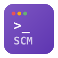
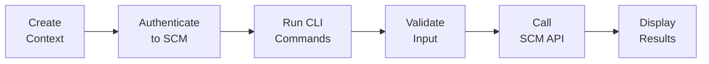

{ .hero-logo }

# SCM CLI

**Command-line interface for Palo Alto Networks Strata Cloud Manager**

---

Manage your entire Strata Cloud Manager configuration from the terminal. Create, update, and delete objects, network configs, security policies, and more with a consistent, scriptable CLI. Context-based authentication supports multiple tenants, and YAML bulk operations make large deployments easy.

-   :material-console:{ .lg .middle } **Intuitive CLI**

    ---

    Consistent `scm <action> <category> <resource>` structure across 60+ resource types. Easy to learn, easy to script.

-   :material-file-document-multiple:{ .lg .middle } **Bulk Operations**

    ---

    Load configurations from YAML files for efficient batch processing. Dry-run mode previews changes before applying.

-   :material-shield-check:{ .lg .middle } **Validated Input**

    ---

    Pydantic models validate every field before sending to the API. Clear error messages when something is wrong.

-   :material-account-multiple:{ .lg .middle } **Multi-Tenant Contexts**

    ---

    Named authentication contexts let you switch between SCM tenants instantly. Environment variable overrides for CI/CD.

-   :material-network:{ .lg .middle } **Full Coverage**

    ---

    Objects, network, security, deployment, identity, setup, mobile agent, insights, jobs, and commit operations.

-   :material-docker:{ .lg .middle } **Docker Ready**

    ---

    Multi-platform Docker images for AMD64 and ARM64. Mount your contexts and run anywhere.

---

## How It Works

---

## Get Started

-   :material-download:{ .lg .middle } **Install**

    ---

    Prerequisites, installation, and credential setup.

    [:octicons-arrow-right-24: Installation](about/installation.md)

-   :material-rocket-launch:{ .lg .middle } **Quick Start**

    ---

    Create a context and run your first command in minutes.

    [:octicons-arrow-right-24: Getting Started](about/getting-started.md)

-   :material-cog:{ .lg .middle } **Configure**

    ---

    Authentication contexts, environment variables, and Docker setup.

    [:octicons-arrow-right-24: Configuration](guide/configuration.md)

-   :material-book-open-variant:{ .lg .middle } **CLI Reference**

    ---

    Complete command reference for all 60+ resource types.

    [:octicons-arrow-right-24: CLI Reference](cli/index.md)

